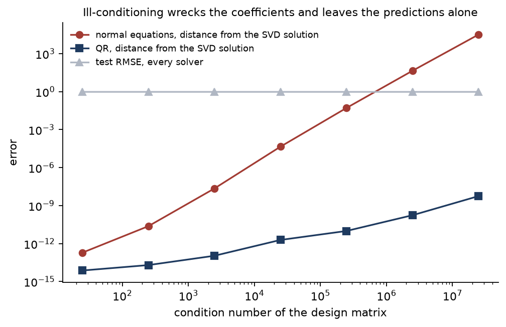

# 1. Linear regression, solved three ways

Fit a line through some points. It is the first thing anyone learns and the last thing anyone
thinks about, which is exactly why it is worth taking apart: every failure mode of the harder
models in this repository already exists here, in a form small enough to see all at once.

**Code:** [`linear.py`](../src/ml_foundations/linear.py) ·
[`e01_linear.py`](../src/ml_foundations/experiments/e01_linear.py) ·
[`test_linear.py`](../../tests/test_linear.py)

## The problem

Given a matrix of features `X` and a target `y`, find the coefficients `w` that make `Xw` as
close to `y` as possible in the squared-error sense:

```
minimise  ||y - Xw||²
```

Differentiate, set to zero, and you get the *normal equations*:

```
XᵀX w = Xᵀy
```

Every textbook stops here, and so does most code: build `XᵀX`, invert it, done. That works.
It is also, in a specific and measurable way, the worst of the three reasonable ways to do it.

## Three solvers

| Solver | What it does | Cost |
|---|---|---|
| `normal` | Forms `XᵀX` and solves the square system | cheapest |
| `qr` | Factors `X = QR`, then back-substitutes `Rw = Qᵀy` | ~2× |
| `svd` | Factors `X = USVᵀ` and inverts the singular values worth trusting | ~6× |

All three minimise the same objective, so on ordinary data they return the same answer. Every
figure below is the median over nine independently generated datasets — a single draw of this
measurement varies by about half a decade, which is enough for the seed rather than the method
to decide the last digit:

<!-- results: ols-solver-agreement -->
| Solver | Digits shared with `svd` | Distance from the truth | Test RMSE |
|---|---:|---:|---:|
| `normal` | >= 14 | 0.211 | 0.999 |
| `qr` | >= 14 | 0.211 | 0.999 |
| `svd` | — (reference) | 0.211 | 0.999 |
<!-- /results -->

Fourteen or more shared digits out of a possible sixteen, and identical distance from the
truth. On data like this the choice does not matter, and anyone who tells you otherwise is
selling something.

*(Anything at or above fourteen digits is reported as `>= 14` rather than as a number. The
difference between fourteen and fifteen significant digits is not a measurement of the method —
it is the last bits of an arithmetic that got the answer right, and it moves with which BLAS
library the machine has.)*

## The condition number

Data is not always like this. When two features carry nearly the same information — a height
in centimetres and the same height in inches, a spend figure and a spend figure with VAT — the
columns of `X` are nearly linearly dependent, and the matrix is *ill-conditioned*.

The condition number measures it: the ratio of the largest to the smallest singular value of
`X`. Read it as digits. A condition number of `10ᵏ` means a solve can lose about `k` of the
sixteen significant digits a float64 carries.

Here is the part that decides between the solvers. Forming `XᵀX` **squares** the condition
number. The normal equations therefore begin their solve having already thrown away twice as
many digits as the problem itself costs.

That is a claim with a number attached, so here is the number. Each row is the same regression
on data generated to be progressively more collinear. The second column is reported *relative
to the first row* — the absolute count sits about half a digit lower on the Linux machine that
checks these numbers than on the macOS machine that generated them, because the two ship
different BLAS libraries, and that offset applies to every row at once. Subtracting the first
row removes it and leaves the rate, which is what the lesson is claiming:

<!-- results: ols-conditioning -->
| Condition number of X | Digits lost by `normal` | Digits kept by `qr` | Distance from the truth | Test RMSE |
|---|---:|---:|---:|---:|
| 3e+01 | 0 | >= 14 | 1.2e+00 | 0.988 |
| 3e+02 | 2 | >= 14 | 1.2e+01 | 0.989 |
| 3e+03 | 4 | >= 14 | 1.2e+02 | 0.989 |
| 3e+04 | 6 | >= 14 | 1.2e+03 | 0.989 |
| 3e+05 | 8 | >= 14 | 1.2e+04 | 0.989 |
| 3e+06 | 10 | >= 14 | 1.2e+05 | 0.989 |
| 3e+07 | 12 | >= 14 | 1.2e+06 | 0.989 |
<!-- /results -->

Read the first two columns down. Every factor of ten in the condition number costs the normal
equations **two digits** and costs QR **none**: 0, 2, 4, 6, 8, 10, 12. That is the squaring,
visible as an arithmetic sequence. Twelve digits of a possible sixteen are gone by the last
row, so barely more than one is left; a few rows further and there are none, and nothing in the
fitted model announces it.



*The slope of the red line is exactly −2 digits per decade, because forming `XᵀX` squares the
conditioning before the solve begins. QR works at the conditioning of `X` itself and stays at
machine precision throughout.*

## The trap: this does not show up in the fit

Look at the last column of that table. **The test RMSE is the same in every row**, to three
decimals. Seven orders of magnitude of conditioning, coefficients that end up wrong in the
first digit, and the model predicts exactly as well as it did at the top.

This is the single most useful thing in this lesson. Ill-conditioning does not damage the
predictions, because the direction the data actually varies in is still measured perfectly
well. It damages the *parameters*, and it damages them in a way that no held-out score can
detect, because held-out scores measure predictions.

So if a linear model is doing well and you are quoting its coefficients — feature importances
in a report, an effect size in a paper, a rate handed to a downstream system — the score you
used to justify it did not check the thing you are quoting.

The fourth column is the other half of the story, and it is worse news. It is the distance
between the fitted coefficients and the coefficients the data was generated from, using the
best solver available. It grows tenfold per row regardless of which solver ran. That error is
not numerical and no algorithm removes it: when two columns carry the same information, how
much credit each of them gets is genuinely not determined by the data. Exact arithmetic on an
infinitely fast computer would give the same answer.

Two different failures, then, with two different fixes:

| Failure | Cause | Fix |
|---|---|---|
| Solvers disagree with each other | The algorithm squared the conditioning | Use QR or SVD — free, and always correct |
| All solvers are far from the truth | The data does not identify the parameters | Collect different data, drop a column, or add a penalty ([lesson 3](03-regularization.md)) |

## What the SVD does that QR does not

Push far enough and the columns become exactly dependent, not merely nearly. `XᵀX` is then
singular, and `normal` and `qr` have nothing to return — there is no unique answer.

The SVD keeps working. It inverts only the singular values above a cutoff and treats the rest
as unmeasured, which yields the *minimum-norm* solution: of the infinitely many coefficient
vectors that fit the data equally well, the smallest. That is a defensible choice rather than
a correct one — it is the answer to a question the data cannot settle — but returning it beats
returning a number produced entirely by rounding.

Here are all three on a design matrix whose fourth column is an exact copy of its first:

<!-- results: ols-rank-deficient -->
| Solver | On an exactly duplicated column | Size of the coefficients | Test RMSE |
|---|---:|---:|---:|
| `normal` | refuses to solve | — | — |
| `qr` | returns an answer | larger than 1e10 | 0.11 |
| `svd` | returns an answer | 1.803 | 0.11 |
<!-- /results -->

The middle row is the one to look at. **QR does not refuse.** It returns coefficients of
magnitude `1e10` and above — numbers with no meaning at all, produced by dividing by a
diagonal entry that should have been zero — and it predicts perfectly well while doing it,
because the enormous coefficients very nearly cancel. Nothing about the fitted model announces
that its parameters are noise. The normal equations at least have the decency to fail.

## Why the intercept is fitted by centring

[`LinearRegression`](../src/ml_foundations/linear.py) does not append a column of ones. It
centres the features and the target, fits, and recovers the intercept as
`ȳ - x̄·w`. The two are algebraically identical, and centring is preferred for two reasons:
a column of ones sitting alongside features measured in thousands is itself a source of
ill-conditioning, and — in [lesson 3](03-regularization.md) — it keeps the intercept out of
the penalty, where it does not belong.

## How this is verified

- **Against a reference.** All three solvers match `sklearn.linear_model.LinearRegression`
  to nine decimals, with and without an intercept.
- **Against algebra.** Adding a constant to `y` moves the intercept by exactly that constant
  and leaves every coefficient alone. Multiplying a feature by 100 divides its coefficient by
  100 and touches nothing else. The residual is orthogonal to every column of `X`, which is
  the defining property of a least-squares fit and needs no reference at all.
- **Against the truth.** On 20 000 rows generated from known coefficients, every solver
  recovers them to within 0.02.
- **Against the lesson going stale.** One test asserts the claim this page is built on — that
  `normal` loses accuracy `qr` keeps, and that neither shows up in the fit. If a change ever
  makes this lesson an illustration of nothing, the suite fails.

## Takeaways

1. Use QR or SVD. The extra cost is a small constant factor and it buys the difference between
   thirteen correct digits and one.
2. Compute the condition number of your design matrix. It costs one line and tells you which
   regime you are in.
3. A good held-out score does not license a claim about coefficients. Those are separate
   questions, and only one of them was tested.
4. When the parameters are not identified, that is a property of the data. Reach for
   [lesson 3](03-regularization.md), not for a better solver.

---

Next: [2. Gradient descent and its friends](02-gradient-descent.md) — what to do when there is
no closed form to reach for.
