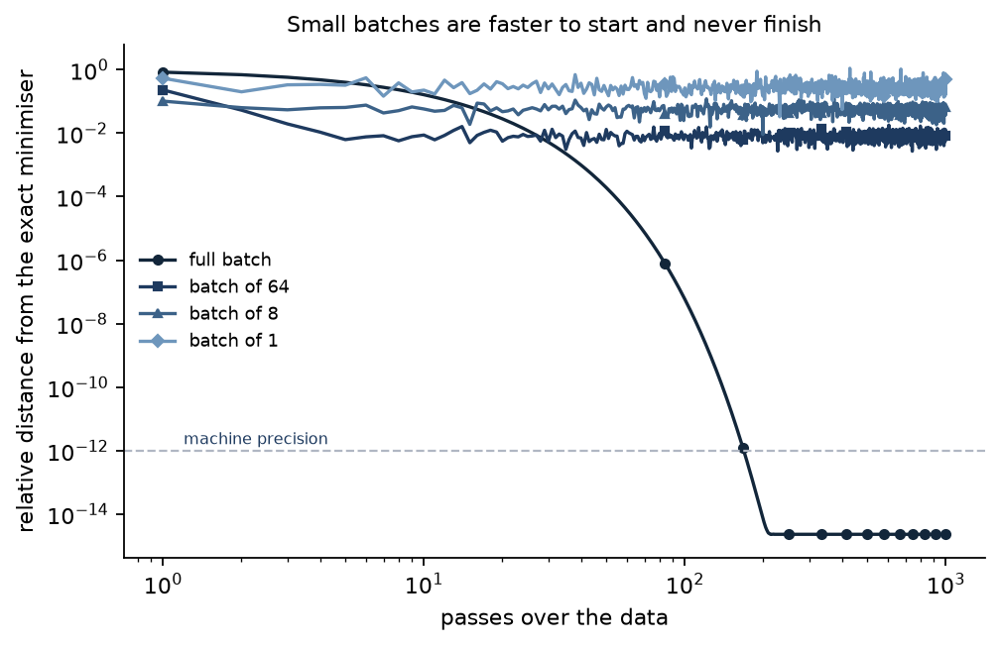

# 2. Gradient descent and its friends

[Lesson 1](01-linear-regression.md) had a closed form. Almost nothing else does, so from here
on the answer is reached by walking towards it. This lesson is about the walk: how big a step
can be, how many steps it takes, and what changes when each step is estimated from a handful
of examples instead of all of them.

Every problem here is least squares, chosen for one reason — the exact answer is available
from lesson 1. That turns every claim into something checkable. "The optimiser converged" is
a statement about the optimiser; "the parameters equal the closed-form minimiser to eight
digits" is a statement about the answer.

**Code:** [`optim.py`](../src/ml_foundations/optim.py) ·
[`e02_gradient_descent.py`](../src/ml_foundations/experiments/e02_gradient_descent.py) ·
[`test_optim.py`](../../tests/test_optim.py)

## How big a step is too big?

For a squared-error objective the curvature is the same everywhere: the Hessian is `2XᵀX/n`, a
constant matrix. Call its largest eigenvalue `L` and its smallest `m`. Then two facts hold
exactly, and neither is a rule of thumb:

- Gradient descent converges **if and only if** the step size is below `2/L`.
- Of the step sizes that converge, the fastest is `2/(L + m)`.

Both are computable before training starts. Here is what happens at step sizes around them.
Step counts throughout this lesson are reported to two significant figures: near convergence
the error falls by a factor of about 1.0005 per step, so the exact step at which a run crosses
a threshold moves by tens either way with the arithmetic of the machine, and pretending
otherwise would put five digits on a two-digit measurement.

<!-- results: gd-learning-rate -->
| Step size | Value | Steps to a relative error of 1e-8 | Final distance |
|---|---:|---:|---:|
| 0.1 × 2/L | 0.0871 | 110 | < 1e-12 |
| 0.5 × 2/L | 0.4355 | 15 | < 1e-12 |
| 2/(L + m) — the optimum | 0.5122 | 11 | < 1e-12 |
| 0.9 × 2/L | 0.7839 | 80 | < 1e-12 |
| 0.99 × 2/L | 0.8623 | 880 | < 1e-12 |
| 1 × 2/L | 0.8710 | did not arrive | 5.6e-01 |
| 1.01 × 2/L | 0.8797 | diverged | — |
| 1.1 × 2/L | 0.9581 | diverged | — |
| 2 × 2/L | 1.7420 | diverged | — |
<!-- /results -->

Three things to take from that table.

**The threshold is sharp.** At `0.99 × 2/L` the run arrives. At `1.01 × 2/L` it overflows.
There is no gentle degradation between them, because the error along the steepest direction is
multiplied by a fixed number every step, and that number crosses one exactly at `2/L`.

**Exactly at the threshold, nothing happens at all.** The multiplier is `-1`: the error along
that direction flips sign and keeps its size, forever. The run neither converges nor
explodes — it sits 0.56 away from the answer and oscillates. A loss curve that has gone flat
does not mean the optimiser is finished.

**Bigger is not faster.** The largest stable step takes **880 steps**; the theoretically
optimal one takes **11**. Turning the learning rate up until just before it breaks is a
popular habit and it is eighty times slower than doing the arithmetic.

## How many steps does it take?

The same condition number that ruined the coefficients in lesson 1 sets the answer here. Let
`κ = L/m` be the condition number of the Hessian. Then plain gradient descent needs a number
of steps proportional to `κ`, and momentum needs one proportional to `√κ`.

Each optimiser below runs at the setting theory prescribes rather than at the best of a
search: `1/L` for plain descent, [Polyak's pair](../src/ml_foundations/optim.py) for momentum,
and Adam at its published default.

<!-- results: gd-conditioning -->
| Condition number of X | …of the Hessian (κ) | √κ | Plain descent | Momentum | Adam |
|---|---:|---:|---:|---:|---:|
| 8 | 68 | 8 | 1,200 | 94 | 5,100 |
| 25 | 615 | 25 | 10,000 | 300 | 9,000 |
| 50 | 2468 | 50 | 40,000 | 600 | 12,000 |
| 124 | 15461 | 124 | 240,000 | 1,500 | 18,000 |
<!-- /results -->

Read the second column against the fourth. `κ` grows by a factor of 227 down the table and
plain descent's step count grows by a factor of 200. Read the third against the fifth: `√κ`
grows by a factor of 15.5 and momentum's step count by 16. The two predictions are not
approximately right, they are right.

The practical size of this: **a five-parameter linear regression takes a quarter of a million
gradient steps** on the last row. There is nothing pathological about that data — it is six
features that happen to be strongly correlated, which is the normal condition of real
features. If a model is training slowly, the first thing to look at is the conditioning of the
inputs, and the cheapest fix is to standardise them.

Adam is the interesting column. It is **worse than plain descent on the easy problem** — 5,100
steps against 1,200 — and better by a factor of thirteen on the hard one. Its per-coordinate
step sizes are a partial substitute for knowing the curvature, which is worth nothing when the
curvature is uniform and worth a great deal when it is not. That is also why it is the default
in deep learning, where nobody can compute `L` and the conditioning is dreadful.

## What mini-batches cost

Real training does not compute the gradient on all the data. It computes it on a batch, which
gives an unbiased estimate with noise. Below, the same problem, the same fixed step size, and
four batch sizes, measured in passes over the data so that everyone pays the same price:

<!-- results: gd-batch-size -->
| Passes over the data | Full batch | Batch of 64 | Batch of 8 | Batch of 1 |
|---|---:|---:|---:|---:|
| 1 | 8.3e-01 | 2.3e-01 | 1.0e-01 | 5.4e-01 |
| 3 | 5.7e-01 | 1.9e-02 | 5.4e-02 | 3.3e-01 |
| 10 | 1.6e-01 | 8.7e-03 | 5.8e-02 | 2.3e-01 |
| 30 | 5.2e-03 | 5.4e-03 | 5.4e-02 | 2.5e-01 |
| 100 | 5.9e-08 | 8.9e-03 | 5.8e-02 | 2.7e-01 |
| 300 | < 1e-12 | 8.5e-03 | 5.2e-02 | 2.5e-01 |
| 1,000 | < 1e-12 | 7.9e-03 | 6.4e-02 | 2.7e-01 |
<!-- /results -->

*Small batches take many more steps per pass and get further per pass — until they reach a
floor and stop. The full-batch run passes them and keeps going to machine precision.*

For the first ten passes, small batches win decisively: after one pass the batch-of-8 run is
eight times closer than the full-batch run, because it took 64 steps while the other took one.

Then they stop. **Batch of 64 is no closer after 1,000 passes than it was after 10.** Every
batch gradient is the true gradient plus noise; a fixed step size keeps re-injecting that
noise, and the run settles into an orbit whose radius is set by the step size and the batch
size rather than by patience. Smaller batches mean more noise and a wider orbit — a factor of
eight between each column here.

This is worth internalising because of how it looks from outside. A training curve that
flattens gets read as "converged", and the difference between a model at its optimum and a
model orbiting a hundredth of the way out is invisible in that curve.

The classical fix is to shrink the step size as training proceeds. Steps of size `lr/(1+ct)`
still sum to infinity, so nothing is out of reach, but their squares sum to something finite,
so the noise is eventually damped:

<!-- results: gd-decay -->
| Decay rate | Distance after 1,000 passes |
|---|---:|
| none (fixed step) | 6.4e-02 |
| 1e-05 | 4.2e-02 |
| 0.0001 | 7.9e-03 |
| 0.001 | 4.7e-04 |
| 0.01 | 7.1e-06 |
<!-- /results -->

Four orders of magnitude, from one line of arithmetic and no extra gradient evaluations.

## The one Adam detail worth knowing

Adam keeps a running mean of the gradient and a running mean of its square, both starting at
zero. Early on, both are biased towards zero, and dividing one by the root of the other does
not cancel it — so the first steps come out far too small. Adam corrects for this by dividing
each running mean by `1 - β^t`.

With `β₂ = 0.999`, "early on" means the first several hundred steps. A test in
[`test_optim.py`](../../tests/test_optim.py) pins the corrected behaviour: the very first Adam
step has length exactly `lr` in every coordinate, whether that coordinate's gradient was 0.001
or 100. That scale invariance is the property the method is named for, and dropping the bias
correction silently destroys it.

## How this is verified

- **Against the exact answer.** Every optimiser is required to reach the closed-form
  least-squares solution from lesson 1 to eight digits — not to stop moving, to *arrive*.
- **Against theory, from both sides.** One test runs at `0.98 × 2/L` and asserts convergence,
  then at `1.02 × 2/L` and asserts divergence.
- **Against the claims on this page.** Momentum must beat plain descent by at least a factor
  of five on an ill-conditioned problem; mini-batch descent must plateau above `1e-3` while
  full-batch descent reaches below `1e-12`; a smaller batch must plateau higher than a larger
  one; and the decay schedule must close the gap by a factor of a hundred.
- **Against sloppiness in the batch gradient.** The mean of the batch gradients over a
  partition of the data must equal the full gradient exactly.

## Takeaways

1. For a quadratic, the stable step size is `2/L` and the fastest is `2/(L+m)`. Both are worth
   computing rather than searching for.
2. Turning the learning rate up to just below where it breaks is slower than the optimum, not
   faster.
3. Steps needed scale with the condition number, and with its square root if you use momentum.
   Standardising the inputs is the cheapest optimiser improvement available.
4. Mini-batch descent with a fixed step size does not converge. It orbits. The training curve
   looks the same either way.
5. A flat loss curve is not evidence of an optimum. At exactly `2/L` the loss is flat and the
   answer is 56% away.

---

Previous: [1. Linear regression, solved three ways](01-linear-regression.md) ·
Next: [3. Regularisation and the bias-variance trade-off](03-regularization.md) — what to do
when the data does not determine the parameters.
