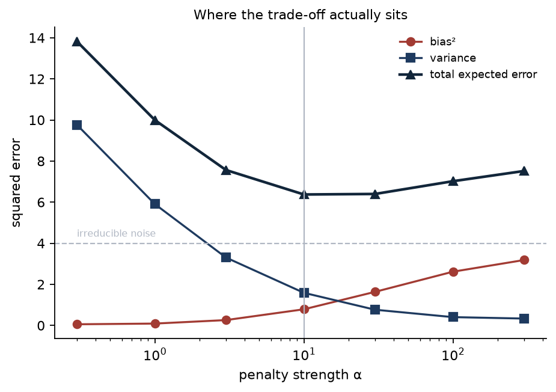
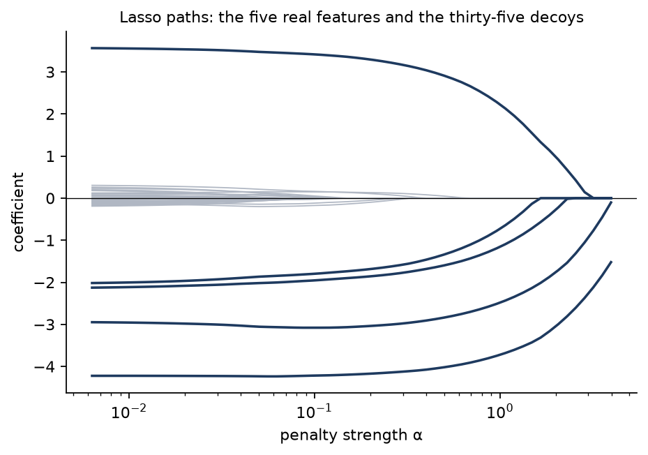

# 3. Regularisation and the bias-variance trade-off

[Lesson 1](01-linear-regression.md) ended on a problem no solver could fix. When two columns
carry the same information, the data does not determine how to split the credit between them,
and the fitted coefficients are whatever the noise happened to suggest. This lesson is the fix:
add a preference of your own — smaller coefficients — and pay for it in bias.

The bias-variance trade-off is normally drawn as two crossing curves with nothing on the axes.
It does not have to be. On data you generated, every term is separately measurable, so the
picture can have numbers on it.

**Code:** [`regularized.py`](../src/ml_foundations/regularized.py) ·
[`e03_regularization.py`](../src/ml_foundations/experiments/e03_regularization.py) ·
[`test_regularized.py`](../../tests/test_regularized.py)

## Two penalties

| Model | Minimises | Effect |
|---|---|---|
| Ridge | `‖y - Xw‖² + α‖w‖²` | Every coefficient shrinks; none reaches zero |
| Lasso | `‖y - Xw‖²/2n + α‖w‖₁` | Coefficients below a threshold become exactly zero |

The difference is not a matter of degree. The derivative of `w²` vanishes at zero, so once a
coefficient is small the penalty has almost no further opinion about it. The derivative of
`|w|` does *not* vanish at zero — it jumps from `-1` to `+1` — so there is a finite amount of
evidence the penalty can overpower completely, and those coefficients come out as exactly
zero rather than nearly zero.

*(The two objectives above are scaled differently, and that is not a typo — it is
scikit-learn's convention, adopted here so the tests can check exact agreement rather than
approximate agreement. An implementation that mixes the two looks broken at every α except
zero.)*

## The trade-off, with numbers on it

Expected squared error decomposes exactly:

```
E[(y - f̂(x))²]  =  bias²  +  variance  +  noise
```

On synthetic data all three terms are computable. The truth is known, so bias can be measured.
The sample can be redrawn, so variance can be measured. The noise level was chosen, so it is
known. Below: 200 training sets of 20 rows each, 15 features, drawn from one fixed world, with
ridge fitted at each penalty strength and asked to predict the same held-out points.

<!-- results: ridge-bias-variance -->
| α | Bias² | Variance | Noise | Sum | Measured test MSE |
|---|---:|---:|---:|---:|---:|
| 0 (no penalty) | 0.090 | 17.914 | 4.000 | 22.004 | 21.983 |
| 0.3 | 0.056 | 9.765 | 4.000 | 13.821 | 13.808 |
| 1 | 0.090 | 5.904 | 4.000 | 9.994 | 9.988 |
| 3 | 0.260 | 3.303 | 4.000 | 7.563 | 7.563 |
| 10 | 0.786 | 1.587 | 4.000 | 6.373 | 6.380 |
| 30 | 1.635 | 0.764 | 4.000 | 6.399 | 6.413 |
| 100 | 2.615 | 0.404 | 4.000 | 7.020 | 7.039 |
| 300 | 3.183 | 0.334 | 4.000 | 7.517 | 7.539 |
<!-- /results -->

**The last two columns are the point.** "Sum" adds the three measured components. "Measured
test MSE" is the actual error of those same models against fresh noisy targets, computed
without reference to the other columns. They agree to within a fraction of a per cent at every
row. The decomposition is not a story about models — it is an identity, and here it is holding.

Read the rest across. Least squares has almost no bias — 0.09, essentially none — and a
variance of 17.9. It is right on average and wrong every time. Pushing α to 10 trades 0.7 of
bias for 16.3 of variance and **cuts the expected error by a factor of 3.5**.



*Bias rises monotonically, variance falls monotonically, and the sum has a minimum in between.
The dashed line is the noise floor: no α reaches it, because no model can.*

Two things that are easy to get wrong:

- **The minimum is broad.** α = 10 gives 6.373 and α = 30 gives 6.399. Anywhere within a
  factor of three of the optimum is fine, which is why coarse logarithmic grids are the right
  way to search for it and why a fourth decimal place of tuning is wasted effort.
- **This trade-off only exists when data is scarce.** Twenty rows for fifteen features is what
  makes the variance term dominate. Re-run this with 200 rows and the best α is zero: the
  penalty has nothing left to buy, and every non-zero value of it is a way of making the model
  worse.

## What the penalty rescues

Back to lesson 1's collinear data, where least squares produced coefficients that were wrong
by two orders of magnitude while predicting perfectly well:

<!-- results: ridge-collinear -->
| α | Distance from the truth | Size of the coefficients | Test RMSE |
|---|---:|---:|---:|
| 0 (least squares) | 1.0e+02 | 1.0e+02 | 0.992 |
| 1e-06 | 1.0e+02 | 1.0e+02 | 0.992 |
| 0.0001 | 5.6e+01 | 5.7e+01 | 0.994 |
| 0.01 | 4.8e+00 | 1.3e+00 | 0.997 |
| 1 | 5.0e+00 | 2.8e-01 | 0.997 |
| 100 | 5.0e+00 | 2.6e-01 | 1.005 |
<!-- /results -->

A penalty of 0.01 brings the coefficients **twenty times closer to the truth** and costs half
a per cent of test RMSE. That is the trade in its most favourable form, and it is available
precisely because the direction being penalised is the one the data had nothing to say about.

Note the first two rows. At α = 1e-6 nothing has happened yet: the penalty has to be
comparable to the smallest squared singular value before it engages. Ridge in the singular
value basis replaces `1/s` with `s/(s² + α)`, so α only matters where `s² ≲ α` — it leaves
the well-measured directions alone and damps the rest.

## What the two penalties do differently

Forty features, of which five are real and thirty-five are pure noise:

<!-- results: lasso-vs-ridge-selection -->
| Model | Features kept | Real features found | Irrelevant features kept | Test RMSE |
|---|---:|---:|---:|---:|
| `ridge` (α = 10) | 40 | 5 of 5 | 35 | 2.369 |
| `ridge` (α = 100) | 40 | 5 of 5 | 35 | 4.820 |
| `lasso` (α = 0.1) | 14 | 5 of 5 | 9 | 1.404 |
| `lasso` (α = 0.5) | 6 | 5 of 5 | 1 | 1.923 |
<!-- /results -->

Ridge keeps all forty features at every penalty strength — that is not a tuning failure, it is
what the squared penalty does. The lasso at α = 0.5 keeps six: all five real ones and a single
false positive, and it predicts better than any ridge here.



*Each line is one coefficient as α increases. The five real features (dark) hold their values
and leave last; the thirty-five decoys (grey) are already at zero for most of the range.*

## The mistake that costs the most

A penalty charges for the size of a coefficient. The size of a coefficient depends on the unit
its feature is measured in. So the penalty depends on your choice of units — and
[lesson 1 proved](01-linear-regression.md) that plain least squares does not.

Below, one genuinely informative feature is re-expressed in a different unit. Nothing about
the problem changes. The same measurement in centimetres carries exactly the information it
carried in metres:

<!-- results: regularization-scaling -->
| Unit of the first feature | That feature | Real features found | Features kept | Test RMSE |
|---|---:|---:|---:|---:|
| × 1000 | kept | 5 of 5 | 5 | 1.773 |
| × 1000, standardised | kept | 5 of 5 | 6 | 1.951 |
| × 1 | kept | 5 of 5 | 6 | 1.923 |
| × 1, standardised | kept | 5 of 5 | 6 | 1.951 |
| × 0.01 | **dropped** | 4 of 5 | 7 | 3.352 |
| × 0.01, standardised | kept | 5 of 5 | 6 | 1.951 |
<!-- /results -->

Measure that feature in a unit a hundred times smaller and **the lasso throws it away**. Its
coefficient has to be a hundred times larger to say the same thing, the penalty charges a
hundred times more for it, and the evidence is no longer worth the price. Test RMSE goes from
1.923 to 3.352 — **74% worse** — and the model reports, in good faith, that the feature was
not useful.

The standardised rows are flat at 1.951 regardless. Standardising costs about one per cent
here in the case where it was not needed, and saves 74% in the case where it was.

So: **standardise before penalising.** Not as a ritual, and not because it helps convergence.
Because without it, α means something different for every column, and which features your
model uses is decided by whoever chose the units.

## How this is verified

- **Against a reference, at five penalty strengths each.** A mismatched scaling convention
  agrees with scikit-learn at exactly α = 0 and nowhere else, so a single-point test would
  pass while the implementation was wrong. Ridge matches to eight decimals; lasso matches to
  five, and — separately checked — selects the identical set of non-zero coefficients.
- **Against brute force.** `soft_threshold` is compared against the numerical minimiser of the
  one-dimensional objective it claims to solve, on a grid of 200,001 points.
- **Against the identity.** One test computes bias, variance and measured error from the same
  60 replicate fits and asserts they satisfy the decomposition to within 3%.
- **Against the claims on this page.** Ridge must never produce an exact zero and lasso must;
  a large enough α must zero everything and leave the intercept at the mean of `y`; ridge must
  beat least squares on the collinear data; and re-scaling a feature must change which
  features the lasso selects, while standardising must prevent it.

## Takeaways

1. The bias-variance decomposition is an identity, not an analogy. On data you generated, you
   can compute all three terms and check they add up.
2. A penalty is worth it when variance dominates — few rows, many features, correlated
   columns. With plenty of data the best penalty is none.
3. The optimum is broad. Search α on a coarse log grid and stop.
4. Ridge shrinks; the lasso selects. If you want a model that uses ten of your four hundred
   features, only one of those is going to do it.
5. Standardise before penalising, always. Otherwise the units decide which features matter.

---

Previous: [2. Gradient descent and its friends](02-gradient-descent.md) ·
Next: [4. Logistic regression, and metrics that lie](04-logistic-regression.md) — the same
machinery, applied to a yes-or-no answer, and the scoring mistakes that follow.
