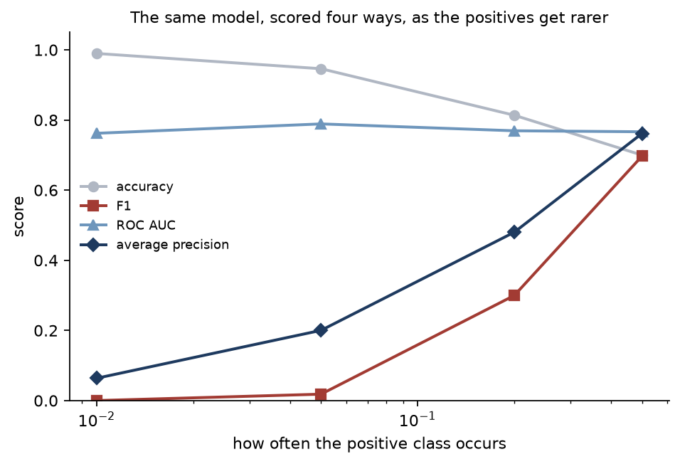

# 4. Logistic regression, and metrics that lie

The model is [lesson 1](01-linear-regression.md) with a different link: the log-odds of the
answer are linear in the features. The fitting method is [lesson 1's solver](../src/ml_foundations/linear.py)
applied repeatedly. Almost nothing in this lesson is about the model.

It is about what happens after it. A classifier produces a number; a decision needs a
threshold and a metric, and both are usually taken by default rather than chosen. This lesson
measures what those defaults cost.

**Code:** [`logistic.py`](../src/ml_foundations/logistic.py) ·
[`e04_logistic.py`](../src/ml_foundations/experiments/e04_logistic.py) ·
[`test_logistic.py`](../../tests/test_logistic.py)

## Fitting it: least squares, repeatedly

There is no closed form for the maximum likelihood estimate. But Newton's method applied to
this likelihood turns out to be exactly *weighted least squares, done repeatedly*. At each
step, form a per-row weight `p(1-p)` and a working response, and solve the problem lesson 1
solved. That is what "iteratively reweighted least squares" means, and it has two consequences
worth knowing:

- **It converges in six or seven iterations,** not thousands. Newton's method is quadratically
  convergent, so the number of correct digits roughly doubles each step. Reaching for gradient
  descent on a problem this shape is leaving that on the table.
- **The numerical judgement from lesson 1 carries straight over.** The implementation here
  solves each step with the same SVD-based least squares rather than by forming and inverting
  a Hessian, for the reason lesson 1 gave.

Two things about the code are worth flagging. Scores are computed as **log-odds**, not
probabilities, wherever a ranking is needed — the two rank identically, but the log-odds keep
their resolution out in the tails where a probability has rounded to 0 or 1. And log loss is
[computed from logits](../src/ml_foundations/metrics.py), so it needs no clipping: the loss of
a confidently wrong prediction is large and finite, and only the round trip through a
probability turns it into infinity.

## Accuracy is not a metric

Below, one model, one set of features, five columns of scores. The only thing changing between
rows is how often the positive class occurs — the base rate is moved by shifting the
intercept, so the two classes keep identical feature distributions throughout.

<!-- results: logistic-imbalance -->
| Positive rate | Accuracy | …of always saying no | Recall | F1 | ROC AUC | Average precision |
|---|---:|---:|---:|---:|---:|---:|
| 50% | 0.700 | 0.501 | 0.691 | 0.697 | 0.766 | 0.761 |
| 20% | 0.814 | 0.797 | 0.197 | 0.300 | 0.769 | 0.480 |
| 5% | 0.946 | 0.947 | 0.009 | 0.018 | 0.789 | 0.200 |
| 1% | 0.990 | 0.990 | 0.000 | 0.000 | 0.762 | 0.064 |
<!-- /results -->

Read the first two columns together. At a 1% base rate the model is **99.0% accurate**, and a
model that always says no is **99.0% accurate**. Accuracy cannot distinguish a trained
classifier from a constant. At a 5% base rate it is worse than that: the model's accuracy of
0.946 is *below* the do-nothing baseline of 0.947.

Now read the last two columns. ROC AUC sits between 0.76 and 0.79 at every base rate — it says
the model is genuinely informative, and it is right. Average precision falls from 0.761 to
0.064, tracking the fact that finding the positives gets harder as they get rarer.

So four metrics tell four different stories about one model:

| Metric | Says | Is it right? |
|---|---|---|
| Accuracy | Excellent, improving | No — it is tracking the base rate |
| F1 | Useless | No — it is tracking the threshold |
| ROC AUC | Informative, unchanged | Yes, about the ranking |
| Average precision | Informative, getting harder | Yes, about the ranking *and* the base rate |

The resolution: **the ranking is fine and the threshold is wrong.** The model orders examples
usefully at every base rate. It just never produces a probability above 0.5, because a
probability above 0.5 would be a lie when only one in a hundred cases is positive.

## The threshold is a decision, not a default

Same fitted model, same test set, nothing refitted. Only the cut-off changes:

<!-- results: logistic-threshold -->
| Threshold | Predicted positive | Precision | Recall | F1 |
|---|---:|---:|---:|---:|
| 0.05 | 2692 | 0.120 | 0.756 | 0.207 |
| 0.1 | 1094 | 0.176 | 0.450 | 0.252 |
| 0.2 | 262 | 0.275 | 0.169 | 0.209 |
| 0.3 | 79 | 0.430 | 0.080 | 0.134 |
| 0.5 (the default) | 11 | 0.364 | 0.009 | 0.018 |
| 0.7 | 1 | 1.000 | 0.002 | 0.005 |
| 0.9 | 0 | 0.000 | 0.000 | 0.000 |
| 0.121 (best F1 here) | 800 | 0.204 | 0.382 | 0.266 |
<!-- /results -->

F1 goes from **0.018 to 0.266** — a factor of fifteen — by changing one number after training.
No new data, no new features, no retraining. At a threshold of 0.7 precision is a perfect
1.000, achieved by making a single prediction all year.

A threshold of 0.5 is the rule that minimises the number of mistakes when the two kinds of
mistake cost the same. If a missed fraudulent transaction costs a hundred times a false alarm,
0.5 is not a neutral default — it is a specific and wrong answer to a question nobody asked.
Pick the threshold from the costs, or from the operating point you can actually staff.

*(That last row is optimistic on purpose. It picks the best threshold by looking at the test
set, which is the mistake [lesson 6](06-evaluation.md) is about. The honest version costs a
validation split and gives a slightly lower number.)*

## When maximum likelihood has no answer

If some hyperplane separates the two classes perfectly, then doubling that hyperplane's
coefficients also classifies everything correctly *and* has a strictly higher likelihood.
So does tripling it. There is no maximum — the likelihood increases without bound, and the fit
returns whatever it had reached when the iteration budget ran out.

This is not exotic. It happens whenever there are enough features relative to rows, which here
means forty rows and twenty features. (A test asserts, using a hard-margin linear SVM, that
this training set really is separable.)

<!-- results: logistic-separable -->
| Fit | Size of the coefficients | Training log loss | Test log loss | Test ROC AUC |
|---|---:|---:|---:|---:|
| 5 steps, no penalty | 13.7 | 1.0e-02 | 1.856 | 0.813 |
| 10 steps, no penalty | 36 | 6.8e-05 | 4.949 | 0.806 |
| 25 steps, no penalty | 90 | 2.8e-10 | 12.471 | 0.804 |
| 50 steps, no penalty | 98.6 | 3.5e-11 | 13.650 | 0.804 |
| 100 steps, no penalty | 103 | 1.3e-11 | 14.239 | 0.804 |
| converged, α = 0.1 | 6.18 | 5.7e-02 | 0.870 | 0.825 |
| converged, α = 1 | 2.67 | 1.7e-01 | 0.537 | 0.830 |
| converged, α = 10 | 0.875 | 3.9e-01 | 0.555 | 0.818 |
<!-- /results -->

The training log loss reaches `1.3e-11` — a perfect fit by any reading of the training
objective. The held-out log loss reaches **14.2**, twenty-six times worse than the penalised
model's 0.537. The model is not merely wrong; it is *confidently* wrong, which is what a log
loss of 14 means.

And here is the part that connects back to the top of the page: **the test ROC AUC barely
moves.** 0.813 down to 0.804. A metric that only reads the ranking cannot see any of this,
because the divergence scales every score by the same factor and leaves the order untouched.
Only a metric that reads the probabilities — log loss here, calibration in
[lesson 6](06-evaluation.md) — detects it.

The fix is one line: any penalty at all. It gives the optimisation something finite to find,
converges in under ten iterations, and improves every held-out number including the AUC.

## How this is verified

- **Against a reference, penalised and unpenalised.** scikit-learn regularises by default, so
  a maximum likelihood implementation compared against it naively disagrees everywhere and
  looks broken. Both cases are checked here, at three penalty strengths, because a wrong
  scaling convention passes the unpenalised test and fails only the penalised one.
- **Against the first-order condition.** At the optimum the residual `y - p` must be
  orthogonal to every feature — the same property lesson 1 checked for least squares, and it
  needs no reference at all.
- **Against the definition of an optimum.** The fitted parameters are perturbed in twenty
  random directions and the penalised objective must increase in all of them. Convergence
  tests check that an optimiser stopped; this checks that it stopped somewhere correct.
- **Against the truth.** On 60,000 rows generated from known coefficients, the fit recovers
  them to within 0.05.
- **Against the claims on this page.** One test asserts accuracy above 0.98 with recall below
  0.2 on the same model; another asserts the coefficients grow fivefold with the iteration
  budget on separable data while the AUC moves by less than 0.05.

## Takeaways

1. Never report accuracy without the base rate beside it. At 1% positives, 99% accuracy is
   what doing nothing scores.
2. ROC AUC and average precision measure the ranking. Log loss and calibration measure the
   probabilities. They are different questions and a model can pass one and fail the other.
3. The threshold is a business decision. It is worth more than most modelling work — a factor
   of fifteen in F1 here — and it costs one line.
4. On separable data the maximum likelihood estimate does not exist. Your fit will not tell
   you; it will return the iteration budget's opinion.
5. Separation comes from having too many features for the sample, not from the classes being
   far apart. Any penalty fixes it.

---

Previous: [3. Regularisation and the bias-variance trade-off](03-regularization.md) ·
Next: [5. Trees, and why one is never enough](05-trees-and-ensembles.md) — leaving linear
models behind.
