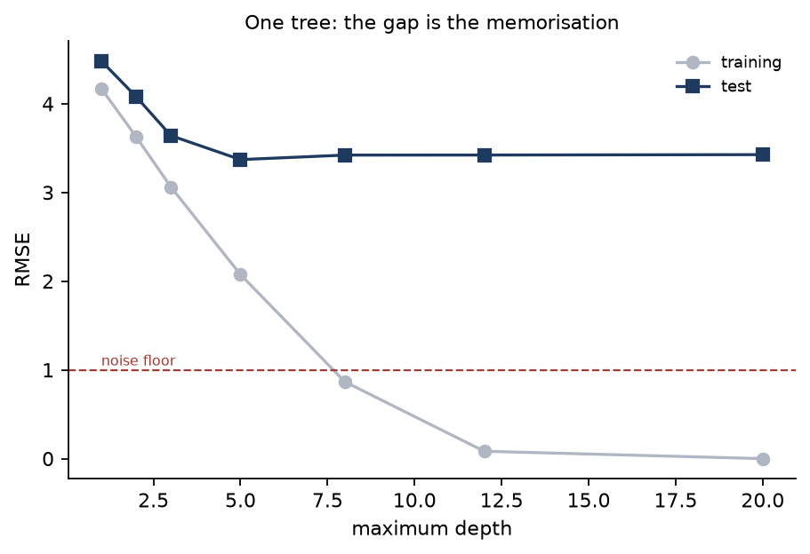
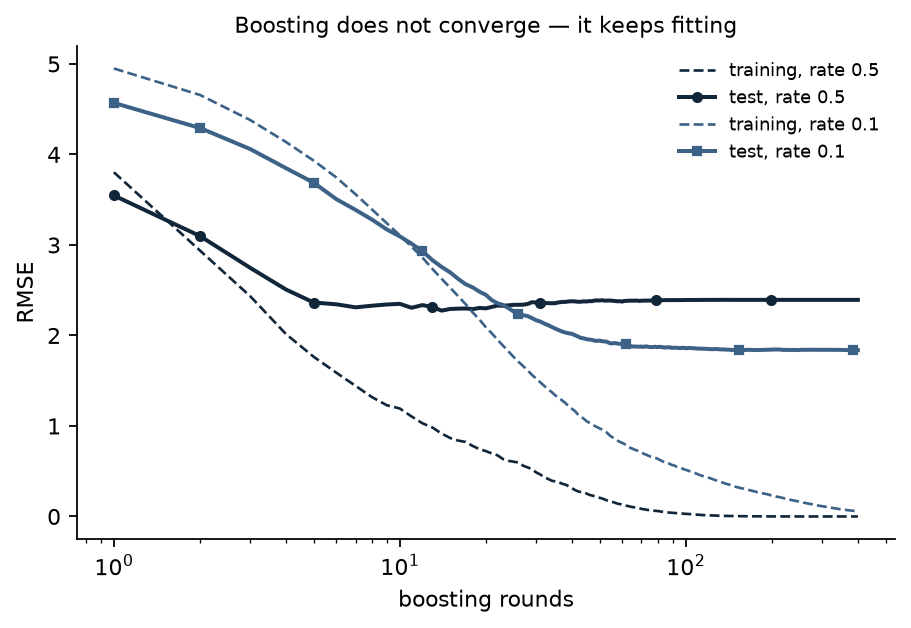

# 5. Trees, and why one is never enough

Every model so far has been linear in the features. Real surfaces bend and interact, and no
amount of penalty tuning fixes a model that cannot represent the shape of the answer.

A tree asks a sequence of yes-or-no questions about one feature at a time and predicts a
constant in each region it carves out. Two properties follow immediately: it can represent
interactions and curvature that a linear model cannot, and it is completely indifferent to the
units of its inputs — only the *order* of the values decides which splits exist, so nothing
needs standardising, ever. (A test asserts this by putting one feature through `exp` and
another through a rescale, and checking the predictions do not move by a single bit.)

The cost is that a tree left to grow will memorise its training set exactly.

**Code:** [`trees.py`](../src/ml_foundations/trees.py) ·
[`ensembles.py`](../src/ml_foundations/ensembles.py) ·
[`e05_trees.py`](../src/ml_foundations/experiments/e05_trees.py) ·
[`test_trees.py`](../../tests/test_trees.py)

## One tree, growing

Friedman's regression surface: two features that interact through a sine, one that enters
squared, two linear, and five that do nothing at all. The noise floor is 1.0 — no model can
beat that.

<!-- results: tree-depth -->
| Max depth | Leaves | Training RMSE | Test RMSE | Gap |
|---|---:|---:|---:|---:|
| 1 | 2 | 4.172 | 4.483 | 0.310 |
| 2 | 4 | 3.629 | 4.081 | 0.451 |
| 3 | 8 | 3.062 | 3.641 | 0.578 |
| 5 | 31 | 2.074 | 3.370 | 1.297 |
| 8 | 154 | 0.866 | 3.421 | 2.556 |
| 12 | 327 | 0.083 | 3.422 | 3.338 |
| 20 | 360 | 0.000 | 3.426 | 3.426 |
<!-- /results -->

Training RMSE reaches **exactly zero** — 360 leaves for 360 training rows, one region per
observation. The test RMSE has stopped improving by depth 5 and never gets worse either; it
just sits at 3.42 while the training error walks to zero underneath it.

That last point is worth dwelling on. The usual picture of overfitting has test error curving
back *upward*. Here it plateaus. Both are overfitting — the model is spending all its capacity
on structure that does not generalise — but only one of them is visible as a rise. If you are
watching for the upward turn to tell you when to stop, you will not see it here.

The gap between the two columns is the honest signal, and at depth 20 the gap is the entire
test error.

## Which term does each ensemble move?

[Lesson 3](03-regularization.md) established that expected error decomposes into bias,
variance and noise, and that all three are measurable on data you generated. Applying the same
measurement to ensembles turns two pieces of folklore into two columns.

Twenty training sets, drawn from the same world, each fitted with each model:

<!-- results: ensemble-decomposition -->
| Model | Bias² | Variance | Sum | Measured test MSE |
|---|---:|---:|---:|---:|
| one deep tree | 3.935 | 5.796 | 10.732 | 10.761 |
| bagging, 25 trees | 4.124 | 1.201 | 6.324 | 6.349 |
| random forest, 25 trees | 5.545 | 0.855 | 7.399 | 7.391 |
| boosting, 100 rounds | 1.640 | 1.170 | 3.811 | 3.827 |
<!-- /results -->

**Bagging cut the variance by a factor of five and left the bias alone** (3.94 to 4.12 —
unchanged within the noise of the measurement). That is exactly what averaging does: each tree
is grown on a bootstrap resample and is wrong in its own direction, and independent errors
average away. Nothing about averaging makes a model capable of representing something it could
not represent before, which is why the bias does not move.

**Boosting cut the bias by more than half** — 3.94 to 1.64 — and cut the variance too. It is
not an average; it is a sum, where each shallow tree is fitted to what the ensemble so far got
wrong, so the ensemble becomes capable of more with every round.

**The random forest is worse than plain bagging here**, and that is not a mistake in the setup.
Restricting each split to three of ten features does what it is supposed to — it gives the
lowest variance in the table, 0.855 — but on this surface it also raises the bias from 4.12 to
5.55, because only five of the ten features carry signal and a random three of ten often
contains none of them. The variance floor of an average is `ρσ²`, set by how correlated the
trees are, and decorrelating them lowers that floor; here the price of decorrelation exceeded
the benefit. Random forests are a good default, not a free lunch.

## Boosting does not converge

Averaging has a limit: add more trees to a bagged ensemble and it settles down. Boosting has
no limit. It keeps fitting whatever is left, and what is left eventually is noise.

<!-- results: boosting-rounds -->
| Learning rate | Rounds | Training RMSE | Test RMSE |
|---|---:|---:|---:|
| 0.5 | 1 | 3.803 | 3.547 |
| 0.5 | 5 | 1.764 | 2.364 |
| 0.5 | 10 | 1.193 | 2.349 |
| 0.5 | 25 | 0.605 | 2.338 |
| 0.5 | 50 | 0.206 | 2.386 |
| 0.5 | 100 | 0.030 | 2.391 |
| 0.5 | 200 | 0.001 | 2.393 |
| 0.5 | 400 | 0.000 | 2.393 |
| 0.5 | **14** (best) | 0.916 | 2.275 |
| 0.1 | 1 | 4.950 | 4.570 |
| 0.1 | 5 | 3.931 | 3.688 |
| 0.1 | 10 | 3.107 | 3.095 |
| 0.1 | 25 | 1.763 | 2.265 |
| 0.1 | 50 | 0.972 | 1.943 |
| 0.1 | 100 | 0.515 | 1.859 |
| 0.1 | 200 | 0.232 | 1.843 |
| 0.1 | 400 | 0.057 | 1.838 |
| 0.1 | **395** (best) | 0.059 | 1.838 |
<!-- /results -->

At a learning rate of 0.5 the training error is essentially zero by round 200 and the test
error bottomed out at **round 14**. Everything after that was work spent getting worse. At a
rate of 0.1 the ensemble is still improving at round 395 and reaches a materially better
answer — 1.838 against 2.275.

That is the trade: a smaller learning rate needs roughly proportionally more rounds and finds a
better optimum. Twenty-eight times the rounds for a 19% better error. Whether that is worth it
is a budget question, but the direction is reliable, and "number of rounds" is not a parameter
to leave at its default.

## Match the model to the shape of the answer

Same four models, two datasets. One is linear by construction; the other is Friedman's surface,
which no linear model can fit.

<!-- results: model-choice -->
| Data | Ridge | One tree | Random forest | Boosting |
|---|---:|---:|---:|---:|
| `linear` | 1.067 | 4.167 | 3.157 | 2.161 |
| `Friedman` | 2.796 | 3.421 | 2.503 | 1.824 |
<!-- /results -->

On linear data, **ridge beats boosting by a factor of two and a single tree by a factor of
four**, and it fits in one SVD. A tree approximates a straight line with a staircase and needs
a great many steps to do it badly.

On the Friedman surface the order reverses: boosting wins, the forest beats ridge, and ridge is
doing the best a plane can do against a curved surface.

Neither row makes one model better than the other. They make the point that model choice is a
statement about the shape of the answer, and that a boosted ensemble of 200 trees losing to a
five-line closed form is a completely ordinary outcome when the truth happens to be linear.

## How this is verified

Trees are harder to check against a reference than linear models, because two implementations
that both split optimally can still disagree when two candidate splits score *identically*. So
the checks are layered:

- **Exact agreement** with scikit-learn's tree, on data with no ties, up to depth 4 for
  classification and depth 5 for regression.
- **No worse than the reference** past that. At depth 5 the two produce different partitions
  with identical training impurity — a genuine tie, and demanding equality there would be
  testing a coincidence. At depth 6 this implementation's partition is *better*. The test
  asserts the inequality that is actually meaningful.
- **Brute force, with no reference at all.** Every candidate threshold of every feature is
  re-scored from the definition, and the split the vectorised search chose must be the
  minimiser.
- **Exact recovery.** A tree fitted to a noiseless piecewise-constant function reproduces it to
  the last bit, in exactly three leaves.
- **Within reach of the reference** for the ensembles. The bootstrap draws and feature subsets
  differ, so equality is impossible; a broken split rule or a mis-scaled average would not land
  within 15% of a mature implementation, so the bound is still a real check.
- **The claims on this page.** A deep tree must reach zero training error and score worse on
  test than a shallow one; bagging must beat the tree it is made of; boosting's training error
  must decrease at every single round.

## Takeaways

1. Trees need no scaling and no transformation of the inputs. Only the order of values matters.
2. A tree grown to purity has one leaf per training row. Watch the train-test *gap*, not the
   test curve — it does not always turn upward.
3. Bagging removes variance and leaves bias where it was. Boosting removes bias. Reach for
   whichever one your error is actually made of, and lesson 3's decomposition tells you which.
4. A random forest can be worse than plain bagging when most features are irrelevant.
   Decorrelating the trees costs bias, and sometimes the cost exceeds the benefit.
5. Boosting has no natural stopping point. The number of rounds and the learning rate trade
   against each other and both need choosing.
6. On linear data a linear model wins, easily. Model choice is a claim about the shape of the
   answer.

---

Previous: [4. Logistic regression, and metrics that lie](04-logistic-regression.md) ·
Next: [6. Evaluation](06-evaluation.md) — the lesson that decides whether any of the previous
five told you the truth.
