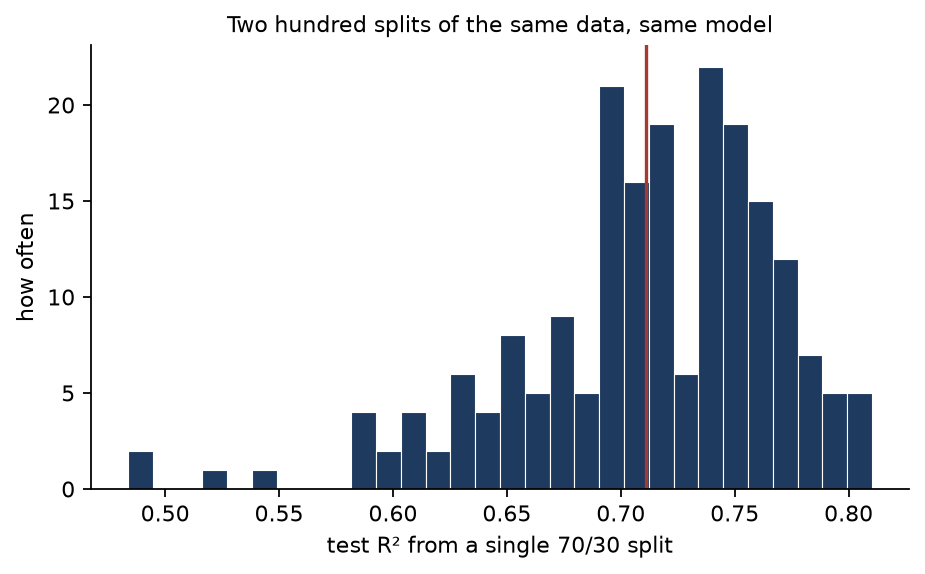
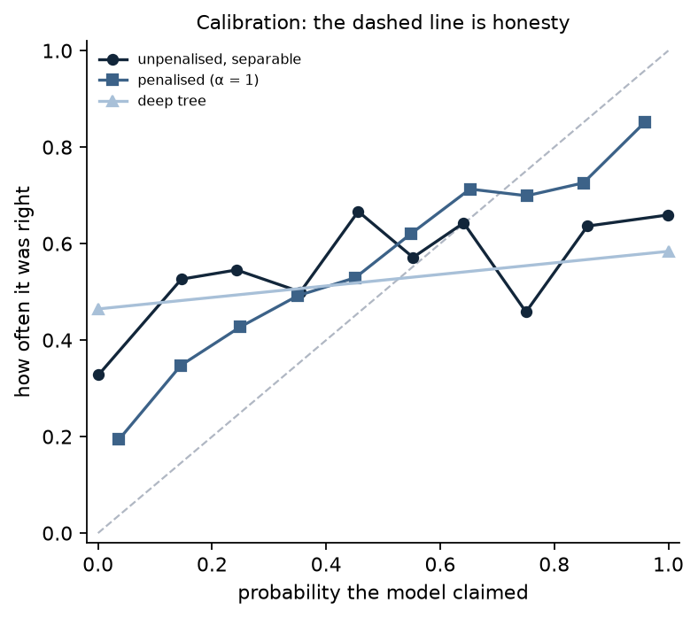

# 6. Evaluation: the part that decides whether any of it was real

Every lesson so far ended by reporting a held-out number and asking you to believe it. This one
is about whether that belief was earned.

Nothing here is difficult. The mistakes it covers are mistakes of *procedure*, and they share
one property that makes them dangerous: **they do not raise an exception, they raise the
score.** A leaky pipeline runs cleanly, finishes quickly, and reports an excellent result.

Most of this lesson runs on [`make_noise`](../src/ml_foundations/datasets.py) — a dataset whose
features and labels are drawn independently. Nothing can be learned from it. The honest score
of any model on it is chance, and that is not an estimate but a fact about how the data was
made. So every number above chance below is a *measurement of a mistake*, and the size of the
mistake is exactly the size of the excess. On real data a suspiciously good score is a
suspicion; here it is a quantity.

**Code:** [`evaluation.py`](../src/ml_foundations/evaluation.py) ·
[`e06_evaluation.py`](../src/ml_foundations/experiments/e06_evaluation.py) ·
[`test_evaluation.py`](../../tests/test_evaluation.py)

## The one rule

> Anything fitted to data must be fitted **inside** the fold.

Scalers, imputation, feature selection, the choice of hyperparameter, the choice of threshold.
All of it. A step that has seen the held-out rows — even without seeing their labels — has put
information into the model that will not be there when the model meets something new.

The rest of this lesson is that rule, with numbers attached.

## Leakage, measured

One hundred rows, two thousand features, labels assigned by a coin. Three pipelines, each
evaluated by five-fold cross-validation, averaged over 25 independently generated datasets:

<!-- results: leakage-selection -->
| Pipeline | Cross-validated accuracy | …ROC AUC | Excess over chance |
|---|---:|---:|---:|
| select the best 20 features on all the data, then cross-validate | 0.848 | 0.923 | 0.423 |
| select the best 20 features inside each fold | 0.504 | 0.497 | -0.003 |
| no selection at all — take the first 20 features | 0.498 | 0.479 | -0.021 |
<!-- /results -->

**An ROC AUC of 0.923 on data that contains nothing.** Accuracy of 85%. Those are numbers that
end a review meeting. The two honest pipelines land on 0.497 and 0.479 — chance, as they must.

The difference between the first two rows is one line of code in one place. The selection step
is identical; the only change is whether it runs before the split or inside it. Running it
first lets it scan two thousand columns for the twenty that happen to correlate with *these
hundred labels* — including the labels of every row that cross-validation is about to hold out.
By the time the folds are drawn, the test rows have already voted on which features exist.

This is the single most common way a machine learning result turns out to be nothing, and it
is worth noticing how *reasonable* the leaky version looks: select features, then
cross-validate the model. Two defensible steps in an indefensible order.

### Not all leakage is equal

The same experiment, with the mistake moved to a scaler — standardising the whole dataset
before splitting, rather than fitting the scaler inside each fold:

<!-- results: leakage-scaler -->
| Pipeline | Cross-validated ROC AUC | Excess over chance |
|---|---:|---:|
| scaler fitted on everything, before splitting | 0.498 | -0.002 |
| scaler fitted inside each fold | 0.497 | -0.003 |
<!-- /results -->

**No measurable difference.** This is worth reporting honestly rather than folding into a
general warning. A scaler looks only at the distribution of the features and never at the
labels, so what it leaks is a marginal mean and standard deviation — real, but almost
worthless. Feature selection looks at the labels, and that is what makes it catastrophic.

Still fit the scaler inside the fold: it costs nothing, and the moment your preprocessing grows
a label-dependent step the distinction stops being safe to rely on. But if you are hunting for
why a result did not replicate, look first at every step that touched `y`.

## One split is a lottery

Below: the same 300-row dataset and the same model, evaluated by a single 70/30 split, 200
times with different random splits.

<!-- results: split-variance -->
| Estimate | Mean R² | Spread | Worst | Best |
|---|---:|---:|---:|---:|
| one 70/30 split, repeated 200 times | 0.711 | 0.058 | 0.484 | 0.810 |
| 5-fold cross-validation, the five folds | 0.723 | 0.052 | 0.640 | 0.799 |
<!-- /results -->

The same model, on the same data, scores anywhere from **0.484 to 0.810** depending on which
rows it happened to hold out. If you have ever seen two people report different numbers for
the same model and assumed one of them made a mistake, this is the more likely explanation.

Cross-validation does not remove that variance — the per-fold spread is about the same. What it
does is *average over it*: five folds instead of one, so the standard error of the estimate
falls by roughly √5. Same data, same cost within a small factor, a considerably more stable
answer.

Two practical consequences. Report cross-validated numbers, not single-split numbers. And when
comparing two models whose scores differ by less than the fold-to-fold spread, you have not
shown anything.

## Choosing on the test set

Here is the trap that survives everything above. The pipeline is clean, nothing leaks, the
cross-validation is honest — and then sixty models are tried and the best one is reported.

Sixty candidates, each a random handful of five features, on data that still contains nothing:

<!-- results: selection-optimism -->
| Estimate | ROC AUC |
|---|---:|
| average of all 60 candidates, on the set used to choose | 0.495 |
| **best** of 60, on the set used to choose | 0.629 |
| that same winner, on data it did not choose on | 0.490 |
| nested cross-validation over the whole procedure | 0.502 |
<!-- /results -->

The average candidate scores 0.495 — chance, correctly. The *best* of sixty scores 0.629. The
same winning model, on data that had no part in crowning it, scores 0.490 — chance again.

Nothing was fitted on the test set. No feature saw a held-out label. The only thing that
happened is that sixty noisy estimates of 0.5 were computed and the largest was reported. **The
maximum of sixty noisy estimates is not an estimate of anything** — it is a measurement of how
noisy they were, and reporting it as a model's score is how a null result becomes a paper.

The last row is the fix. Nested cross-validation puts the *choosing* inside the loop too: an
outer fold is held out, the candidate is selected using only the inner folds, and the outer
fold scores the resulting procedure. It reports 0.502. That is the correct answer, and it is
correct because it estimates the thing you would actually deploy — a procedure that includes
picking a winner — rather than a model that was chosen with hindsight.

Every hyperparameter search, architecture comparison, and "we tried a few things" is a
selection over candidates. If the number you report came from the same data that chose the
winner, it is the 0.629.

## Calibration: the question the ranking metrics cannot answer

[Lesson 4](04-logistic-regression.md) ended on a model whose probabilities were destroyed while
its ROC AUC barely moved. AUC is a rank statistic — it is unchanged by any monotone rescaling of
the scores — so no amount of overconfidence can show up in it.

Calibration is the missing question: *when this model says 0.8, is it right 80% of the time?*

<!-- results: calibration -->
| Model | ROC AUC | Calibration error | Average confidence |
|---|---:|---:|---:|
| unpenalised, separable | 0.716 | 0.329 | 0.990 |
| penalised (α = 1) | 0.781 | 0.131 | 0.823 |
| deep tree | 0.546 | 0.452 | 1.000 |
<!-- /results -->

The deep tree is the clearest case. It claims an average confidence of **1.000** — every
prediction is a certainty — and it ranks barely better than chance, 0.546. Every leaf holds a
handful of training rows, all of one class, so every leaf reports a probability of exactly 0 or
1. It is not lying about the ranking. It is lying about how much it knows.

The unpenalised logistic model from lesson 4 is the subtler case: 99% average confidence, and a
ranking that is genuinely worse than the penalised model's. The penalty improves both.

This matters whenever a probability is used as a *number* rather than as an ordering — a
threshold set from expected cost, a score fed to another system, a risk shown to a person.
Expected calibration error is a coarse instrument and its value moves with the number of bins,
which is why it is reported here next to the curve it summarises rather than on its own.

## How this is verified

Splitters cannot be checked by equality — two implementations shuffle differently and there is
no canonical partition. So:

- **Every property a partition must have.** The test folds cover each row exactly once, train
  and test never intersect, fold sizes differ by at most one, and the same seed reproduces the
  same folds while a different one does not.
- **Agreement on the part that is not arbitrary.** Given scikit-learn's own folds, the per-fold
  scores must match its `cross_val_score` to ten decimals.
- **Stratification, from both sides.** One test shows unstratified folds losing a rare class
  entirely, and shows stratified folds spreading it as evenly as arithmetic allows.
- **Calibration by hand.** There is no reference implementation, so expected calibration error
  is checked against a four-point case worked out on paper, and against a model constructed to
  be perfectly calibrated.
- **The claim this lesson turns on.** One test builds a classifier with a perfect AUC and a
  calibration error above 0.4, which is only possible if the two metrics are measuring
  genuinely different things.

## Takeaways

1. Fit nothing outside the fold. The rule is short because the exceptions are not worth the
   risk of remembering.
2. Steps that touch `y` leak catastrophically; steps that only touch `X` usually leak very
   little. Both should live inside the fold; only one will destroy your result.
3. A single train/test split is a lottery with a range of 0.33 in R² on 300 rows. Cross-validate
   and report the spread.
4. The best of *N* tried options is not an estimate of that option's quality. Nested
   cross-validation estimates the procedure, which is what you actually ship.
5. Ranking and calibration are different questions. A model can be perfect at one and worthless
   at the other, and the metric you reached for probably only answers one of them.
6. Generate a dataset with no signal and run your pipeline on it. If it scores above chance,
   the pipeline is wrong — and you found out in an afternoon rather than in production.

---

Previous: [5. Trees, and why one is never enough](05-trees-and-ensembles.md) ·
Back to the [contents](../README.md)
